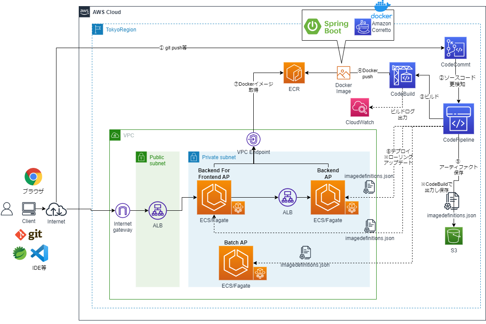

# SpringBoot APをECS/Fargateで動作させCode系でCI/CDするCloudFormationサンプルテンプレート

## 構成
* CDは標準のローリングアップデートとBlueGreenデプロイメントの両方に対応しており、以下のいずれか２つの構成が構築できる。
  * システム構成図　ローリングアップデート版

  * システム構成図　BlueGreenデプロメント版

  * なお、図は、ECSからのAPログ転送にCloudWatch Logs（awslogsドライバ）を利用した場合の例を示している

* メトリックスのモニタリング
  * CloudWatch Container Insightsは有効化し、各メトリックスを可視化。
* ログの転送
  * awslogsドライバを使ったCloudWatch Logsへのログ転送とFireLens+Fluent Bitによるログ転送に対応


* オートスケーリング
  * 平均CPU使用率のターゲット追跡スケーリングポリシーによる例に対応している。


## 事前準備
* CodePipeline、CodeBuildのArtifact用、キャッシュ用のS3バケットを作成しておく
* FireLensを利用する場合はログ出力のS3バケットも作成しておく
  * 後続の手順で、バケット名を変更するパラメータがあるところで指定

## CloudFormationのコマンドについて
* ここでは、aws cloudformation create-stackコマンドを使っているが、deployコマンド等、使う場合は適宜コマンドを読み替えて実行すること
  * 詳細は[（参考）CloudFormationコマンド文法メモ](#参考cloudformationコマンド文法メモ)を参照
## IAM
### 1. IAMの作成
```sh
aws cloudformation validate-template --template-body file://cfn-iam.yaml
aws cloudformation create-stack --stack-name ECS-IAM-Stack --template-body file://cfn-iam.yaml --capabilities CAPABILITY_IAM
```
* CodePipeline、CodeBuildのArtifact用、キャッシュ用のS3バケット名を変えるには、それぞれのcnスタック作成時のコマンドでパラメータを指定する
    * 「--parameters ParameterKey=ArtifactS3BucketName,ParameterValue=(バケット名)」
    * 「--parameters ParameterKey=CacheS3Location,ParameterValue=(パス名)」
    
* TBD
  * IAMポリシーの記載は精査中

## CI環境
### 1. アプリケーションのCodeCommit環境
* 別途、以下の2つのSpringBootAPのプロジェクトが以下のリポジトリ名でCodeCommitにある前提
  * sample-bff
    * BFFのAP
    * sample-bffという別のリポジトリに資材は格納
  * sample-backend
    * BackendのAP
    * sample-backendという別のリポジトリに資材は格納

### 2. ECRの作成
```sh
aws cloudformation validate-template --template-body file://cfn-ecr.yaml
aws cloudformation create-stack --stack-name ECR-Stack --template-body file://cfn-ecr.yaml
```
* ２つのSpringBootAP用と、ログ転送にFireLens利用時のFluentBit用のリポジトリが作成される。
### 3. CodeBuildのプロジェクト作成
```sh
aws cloudformation validate-template --template-body file://cfn-bff-codebuild.yaml
aws cloudformation create-stack --stack-name BFF-CodeBuild-Stack --template-body file://cfn-bff-codebuild.yaml
aws cloudformation validate-template --template-body file://cfn-backend-codebuild.yaml
aws cloudformation create-stack --stack-name Backend-CodeBuild-Stack --template-body file://cfn-backend-codebuild.yaml
```
* Artifact用のS3バケット名を変えるには、それぞれのcfnスタック作成時のコマンドでパラメータを指定する
    * 「--parameters ParameterKey=ArtifactS3BucketName,ParameterValue=(バケット名)」

* 取得したMavenリポジトリをS3にキャッシュする。キャッシュ用のS3のパス（バケット名/プレフィックス）を変えるには、それぞれのcfnスタック作成時のコマンドでパラメータを指定する
    * 「--parameters ParameterKey=CacheS3Location,ParameterValue=(パス名)」

* 本当は、CloudFormationテンプレートのCodeBuildのSorceTypeをCodePipelineにするが、いったんDockerイメージ作成して動作確認したいので、今はCodeCommitになっている。動いてはいるので保留。


### 4. ECRへアプリケーションの最初のDockerイメージをプッシュ
* 2つのCodeBuildプロジェクトが作成されるので、それぞれビルド実行し、ECRにDockerイメージをプッシュさせる。

### 5. （FireLens利用時のみ）Fluent BitのDockerイメージプッシュ
* firelensフォルダにある「extra-for-backend.conf」、「extra-for-backend.conf」の設定ファイル中の「bucket」をログ出力用のS3バケット名に変える
* ログ転送にFireLensを利用する場合、サイドカーコンテナで使用するFluent BitのDockerイメージのビルドし、ECRにイメージをプッシュする
* 以下、コマンドを実行
```sh
cd firelens
set AWS_ACCOUNT_ID=(アカウントID)
set AWS_REGION=(リージョン)　#例: set AWS_REGION=ap-northeast-1
aws ecr get-login-password --region %AWS_REGION% | docker login --username AWS --password-stdin %AWS_ACCOUNT_ID%.dkr.ecr.%AWS_REGION%.amazonaws.com
```
```sh
docker build -t fluent-bit-bff -f DockerFileForBff .
docker tag fluent-bit-bff:latest %AWS_ACCOUNT_ID%.dkr.ecr.%AWS_REGION%.amazonaws.com/fluent-bit-bff:latest
docker push %AWS_ACCOUNT_ID%.dkr.ecr.%AWS_REGION%.amazonaws.com/fluent-bit-bff:latest
```
```sh
docker build -t fluent-bit-backend -f DockerFileForBackend .
docker tag fluent-bit-backend:latest %AWS_ACCOUNT_ID%.dkr.ecr.%AWS_REGION%.amazonaws.com/fluent-bit-backend:latest
docker push %AWS_ACCOUNT_ID%.dkr.ecr.%AWS_REGION%.amazonaws.com/fluent-bit-backend:latest
```

## ネットワーク環境
### 1. VPCおよびサブネット、Publicサブネット向けInternetGateway等の作成
```sh
aws cloudformation validate-template --template-body file://cfn-vpc.yaml
aws cloudformation create-stack --stack-name ECS-VPC-Stack --template-body file://cfn-vpc.yaml
```
### 2. Security Groupの作成
```sh
aws cloudformation validate-template --template-body file://cfn-sg.yaml
aws cloudformation create-stack --stack-name ECS-SG-Stack --template-body file://cfn-sg.yaml
```
* 必要に応じて、端末の接続元IPアドレス等のパラメータを指定
    * 「--parameters ParameterKey=TerminalCidrIP,ParameterValue=X.X.X.X/X」

### 3. VPC Endpointの作成とプライベートサブネットのルートテーブル更新
```sh
aws cloudformation validate-template --template-body file://cfn-vpe.yaml
aws cloudformation create-stack --stack-name ECS-VPE-Stack --template-body file://cfn-vpe.yaml
```
### 4.（作成任意）NAT Gatewayの作成とプライベートサブネットのルートテーブル更新
* 本手順では、ECRのイメージ転送量等にかかるNAT Gatewayのコスト節約から、全てVPC Endpointで作成するので、NAT Gatewayは通常不要。
  * とはいえ、全部VPC Endpointにすると、エンドポイント数分、デモ程度で何度も起動したり落としたりで1時間未満でも時間単位課金でコストがかえって結構かかる場合もある。その場合の調整として、本手順のVPC Endpoint作成対象を減らす等カスタマイズして、VPC Endpoint未作成のリソースアクセスに使用するために以下を追加実行すればよい。

```sh
aws cloudformation validate-template --template-body file://cfn-ngw.yaml
aws cloudformation create-stack --stack-name ECS-NATGW-Stack --template-body file://cfn-ngw.yaml
```

## ElastiCache環境
### 1. ElastiCache for Redisのクラスタ作成
* BFFのAP(sample-bff)ではHTTPセッションを扱うがスケールイン/アウトにも対応できるようセッションを外部化し管理するために、ElasticCache for Redis（クラスタモード無効）を作成する。
  * 作成にしばらく時間がかかる。
```sh
aws cloudformation validate-template --template-body file://cfn-ecache-redis.yaml
aws cloudformation create-stack --stack-name ECS-ECACHE-Stack --template-body file://cfn-ecache-redis.yaml
```
## DB環境
* 各サンプルAPではRDBでデータ管理するため、Aurora for PostgreSQLを作成する。  
  * 作成にしばらく時間がかかる。
```sh
aws cloudformation validate-template --template-body file://cfn-rds-aurora.yaml
aws cloudformation create-stack --stack-name ECS-Aurora-Stack --template-body file://cfn-rds-aurora.yaml --parameters ParameterKey=DBUsername,ParameterValue=postgres ParameterKey=DBPassword,ParameterValue=password
```

## ECS環境
### 1. ALBの作成
* ECSの前方で動作するALBとデフォルトのTarget Group等を作成
  * パラメータTargateGroupAttributesに「deregistration_delay.timeout_seconds」を「60」で設定し、ローリングアップデートの時間を短縮する工夫している
```sh
aws cloudformation validate-template --template-body file://cfn-alb.yaml
aws cloudformation create-stack --stack-name ECS-ALB-Stack --template-body file://cfn-alb.yaml
```
* BlueGreenデプロイメントの場合のみ以下実行し、2つ目（Green環境）用のTarget Groupを作成
  * パラメータTargateGroupAttributesに「deregistration_delay.timeout_seconds」を「60」で設定し、ローリングアップデートの時間を短縮する工夫している
```sh
aws cloudformation validate-template --template-body file://cfn-tg-bg.yaml
aws cloudformation create-stack --stack-name ECS-TG-BG-Stack --template-body file://cfn-tg-bg.yaml
```
* TBD: バックエンドサービスをALBではなく、CloudMapによるサービスディスカバリを使ったサンプル作成を検討

* ~~手順削除：ListenerRuleを使ったTargetGroupの設定~~
~~aws cloudformation validate-template --template-body file://cfn-tg.yaml~~
~~aws cloudformation create-stack --stack-name ECS-TG-Stack --template-body file://cfn-tg.yaml~~

### 2. ECSクラスタの作成
```sh
aws cloudformation validate-template --template-body file://cfn-ecs-cluster.yaml
aws cloudformation create-stack --stack-name ECS-CLUSTER-Stack --template-body file://cfn-ecs-cluster.yaml
```
* 必要に応じてキーペア名のパラメータ値を修正して使用
  * 「Mappings:」の「FrontendClusterDefinitionMap:」の「KeyPairName:」
  * 「Mappings:」の「BackendClusterDefinitionMap:」の「KeyPairName:」  
    * 「myKeyPair」となっているところを自分のキーペア名に修正
### 3. ECSタスク定義の作成
#### 3-1. ログ転送先がCloud Watch Logs（awslogsドライバ）の場合
* awslogsドライバのタスク定義を作成
```sh
aws cloudformation validate-template --template-body file://cfn-ecs-task.yaml
aws cloudformation create-stack --stack-name ECS-TASK-Stack --template-body file://cfn-ecs-task.yaml --parameters ParameterKey=DBUsername,ParameterValue=postgres ParameterKey=DBPassword,ParameterValue=password
```
#### 3-2. カスタムログルーティング（FireLens + Fluent Bit）の場合
* awsfirelensドライバのタスク定義を作成
```sh
aws cloudformation validate-template --template-body file://cfn-ecs-task-firelens.yaml
aws cloudformation create-stack --stack-name ECS-TASK-Stack --template-body file://cfn-ecs-task-firelens.yaml --parameters ParameterKey=DBUsername,ParameterValue=postgres ParameterKey=DBPassword,ParameterValue=password
```

### 4. ECSサービスの実行
#### 4-1. ローリングアップデートの場合
* ローリングアップデートの場合は以下を実行
```sh
aws cloudformation validate-template --template-body file://cfn-ecs-service.yaml
aws cloudformation create-stack --stack-name ECS-SERVICE-Stack --template-body file://cfn-ecs-service.yaml
```
* パラメータMinimumHealthyPercentを0%にしてローリングアップデートの時間を短縮する工夫をしている
#### 4-2. BlueGreenデプロイメントの場合
* BlueGreenデプロイメントの場合は以下のパラメータを指定して起動
```sh
aws cloudformation validate-template --template-body file://cfn-ecs-service.yaml
aws cloudformation create-stack --stack-name ECS-SERVICE-Stack --template-body file://cfn-ecs-service.yaml --parameters ParameterKey=DeployType,ParameterValue=CODE_DEPLOY
```

### 5. APの実行確認
* Backendアプリケーションの確認  
  * VPCのパブリックサブネット上にBationのEC2を起動
```sh
aws cloudformation validate-template --template-body file://cfn-bastion-ec2.yaml
aws cloudformation create-stack --stack-name Demo-Bastion-Stack --template-body file://cfn-bastion-ec2.yaml
```
  * 必要に応じてキーペア名等のパラメータを指定
    * 「--parameters ParameterKey=KeyPairName,ParameterValue=myKeyPair」
  * BastionのEC2のアドレスは、CloudFormationの「Demo-Bastion-Stack」スタックの出力「BastionDNSName」のURLを参照    
  * EC2にSSHでログインし、以下のコマンドを「curl http://(Private ALBのDNS名)/api/v1/todos/」を入力するとバックエンドサービスAPのJSONレスポンスが返却
    * CloudFormationの「ECS-SERVICE-Stack」スタックの出力「BackendServiceURI」のURLを参照

* BFFアプリケーションの確認
  * ブラウザで「http://(Public ALBのDNS名)」を入力しフロントエンドAPの画面が表示される
    * CloudFormationの「ECS-SERVICE-Stack」スタックの出力「FrontendWebAppServiceURI」のURLを参照
  * アプリケーションの操作方法は「sample-bff」のリポジトリのREADME.mdを参照

* APログの確認
  * うまく動作しない場合、APログ等にエラーが出ていないか確認するとよい
  * awslogsドライバの場合は、Cloud Watch Logの以下のロググループ
    * /ecs/logs/Demo-backend-ecs-group
    * /ecs/logs/Demo-bff-ecs-group
  * FireLens+FluentBitの場合は、以下にログ出力
    * Cloud Watch Log
      * AP
        * /ecs/logs/fluentbit-backend-group
        * /ecs/logs/fluentbit-bff-group
      * FluentBit（サイドカー側のコンテナ）
        * /ecs/logs/fluentbit-backend-sidecar
        * /ecs/logs/fluentbit-bff-sidecar
    * S3
      * (ログ出力用のバケット)/fluent-bit-logs/
* Bastionからredis-cliでElastiCacheにアクセスしたい場合
  * 以下参考に、redis-cliをインストールして接続するとよい
  ```sh
  sudo amazon-linux-extras install epel -y
  sudo yum install gcc jemalloc-devel openssl-devel tcl tcl-devel -y
  sudo wget http://download.redis.io/redis-stable.tar.gz
  sudo tar xvzf redis-stable.tar.gz
  cd redis-stable
  sudo make BUILD_TLS=yes

  src/redis-cli -h (ElastiCacheのEndpoint)
  # CloudFormationの「ECS-ECACHE-Stack」スタックの出力「ElastiCachePrimaryEndPoint」

  > keys *  
  ```
* BastionからpsqlでAuroraにアクセスしたい場合
  * 以下参考に、Bastionにpsqlをインストールするとよい
    * https://techviewleo.com/how-to-install-postgresql-database-on-amazon-linux/
  ```sh
  sudo amazon-linux-extras install epel

  sudo tee /etc/yum.repos.d/pgdg.repo<<EOF
  [pgdg14]
  name=PostgreSQL 14 for RHEL/CentOS 7 - x86_64
  baseurl=http://download.postgresql.org/pub/repos/yum/14/redhat/rhel-7-x86_64
  enabled=1
  gpgcheck=0
  EOF
  
  sudo yum makecache
  sudo yum install postgresql14
  
  #DBに接続  
  psql -h aurora-postgresql-cluster.cluster-crby0oqsjgv1.ap-northeast-1.rds.amazonaws.com -U postgres -d testdb    
  ```

### 6. Application AutoScalingの設定
* 以下のコマンドで、ターゲット追跡スケーリングポリシーでオートスケーリング設定
```sh
aws cloudformation validate-template --template-body file://cfn-ecs-autoscaling.yaml
aws cloudformation create-stack --stack-name ECS-AutoScaling-Stack --template-body file://cfn-ecs-autoscaling.yaml
```

* BastionのEC2から、ApacheBench (ab) ユーティリティを使用して、ロードバランサーに短期間に大量のHTTPリクエストを送信
  * abコマンドのインストール
```sh
sudo yum install httpd-tools
```
  * 以下のいずれかのabコマンドを実行
```sh
ab -n 1000000 -c 1000 http://(Private ALBのDNS名)/api/v1/todos/
```
```sh
ab -n 1000000 -c 1000 http://(Public ALBのDNS名)/login
```
* うまくCPU使用率75%以上にならない場合は、abコマンドのパラメータを調整するか、cfn-autoscaling.yamlのCPUUtilizationの値を下げて調整する
* 対象のECSサービスに関するCPU使用率に関するCloudWatchアラームが出ていることを確認
* 対象のECSサービスがスケールアウトされ、1タスク追加され2タスクになっていることを確認
* abコマンドが終了し、しばらくたつと、対象のECSサービスがスケールインされ、1タスクに戻っていることを確認
## CD環境（標準のローリングアップデートの場合）
* ローリングアップデートの場合は、以下のコマンドを実行
### 1. ローリングアップデート対応のCodePipelineの作成
```sh
aws cloudformation validate-template --template-body file://cfn-bff-codepipeline.yaml
aws cloudformation create-stack --stack-name Bff-CodePipeline-Stack --template-body file://cfn-bff-codepipeline.yaml

aws cloudformation validate-template --template-body file://cfn-backend-codepipeline.yaml
aws cloudformation create-stack --stack-name Backend-CodePipeline-Stack --template-body file://cfn-backend-codepipeline.yaml
```

* Artifact用のS3バケット名を変えるには、それぞれのcfnスタック作成時のコマンドでパラメータを指定する
    * 「--parameters ParameterKey=ArtifactS3BucketName,ParameterValue=(バケット名)」
### 2. CodePipelineの確認
  * CodePipelineの作成後、パイプラインが自動実行されるので、デプロイ成功することを確認する
### 3. ソースコードの変更
  * 何らかのソースコードの変更を加えて、CodeCommitにプッシュする
  * CodePipelineのパイプラインが実行され、新しいAPがデプロイされることを確認する

## CD環境（標準のBlueGreenデプロイメントの場合）
* BlueGreenデプロイメントの場合は、以下のコマンドを実行
### 1. CodeDeployの作成
```sh
aws cloudformation validate-template --template-body file://cfn-bff-codedeploy.yaml
aws cloudformation create-stack --stack-name Bff-CodeDeploy-Stack --template-body file://cfn-bff-codedeploy.yaml

aws cloudformation validate-template --template-body file://cfn-backend-codedeploy.yaml
aws cloudformation create-stack --stack-name Backend-CodeDeploy-Stack --template-body file://cfn-backend-codedeploy.yaml
```

* Artifact用のS3バケット名を変えるには、それぞれのcfnスタック作成時のコマンドでパラメータを指定する
    * 「--parameters ParameterKey=ArtifactS3BucketName,ParameterValue=(バケット名)」  
### 2. BlueGreenデプロイメント対応のCodePipelineの作成
```sh
aws cloudformation validate-template --template-body file://cfn-bff-codepipeline-bg.yaml
aws cloudformation create-stack --stack-name Bff-CodePipeline-BG-Stack --template-body file://cfn-bff-codepipeline-bg.yaml

aws cloudformation validate-template --template-body file://cfn-backend-codepipeline-bg.yaml
aws cloudformation create-stack --stack-name Backend-CodePipeline-BG-Stack --template-body file://cfn-backend-codepipeline-bg.yaml
```

* Artifact用のS3バケット名を変えるには、それぞれのcfnスタック作成時のコマンドでパラメータを指定する
    * 「--parameters ParameterKey=ArtifactS3BucketName,ParameterValue=(バケット名)」
### 3. CodePipelineの確認
  * CodePipelineの作成後、パイプラインが自動実行されるので、デプロイ成功することを確認する
### 4. ソースコードの変更
  * 何らかのソースコードの変更を加えて、CodeCommitにプッシュする
  * CodePipelineのパイプラインが実行され、新しいAPがデプロイされることを確認する

## （参考）CloudFormationコマンド文法メモ
* スタックの新規作成
```sh
aws cloudformation create-stack --stack-name myteststack --template-body file://cfn-ec2.yaml
```
* スタックの新規作成(削除保護設定あり)
```sh
aws cloudformation create-stack --stack-name myteststack --enable-termination-protection --template-body file://cfn-ec2.yaml
```
* スタックの更新
```sh
aws cloudformation update-stack --stack-name myteststack --template-body file://cfn-vpc.yaml
```
* スタックのデプロイ（チェンジセット作成しデプロイ）
```sh
aws cloudformation deploy --stack-name myteststack --template-file cfn-vpc.yaml
```
* テンプレートの検証
```sh
aws cloudformation validate-template --template-body file://cfn-vpc.yaml
```
* スタックの削除保護設定解除
```sh
aws cloudformation update-termination-protection --stack-name myteststack --no-enable-termination-protection
```
* スタックの削除
```sh
aws cloudformation delete-stack --stack-name myteststack
```
* IAMロールのスタックの場合 --capabilities CAPABILITY_IAM（またはCAPABILITY_NAMED_IAM）つける
```sh
aws cloudformation create-stack --stack-name my-iamgroup-stack --template-body file://cfn-iamgroup.yaml --capabilities CAPABILITY_IAM
```
